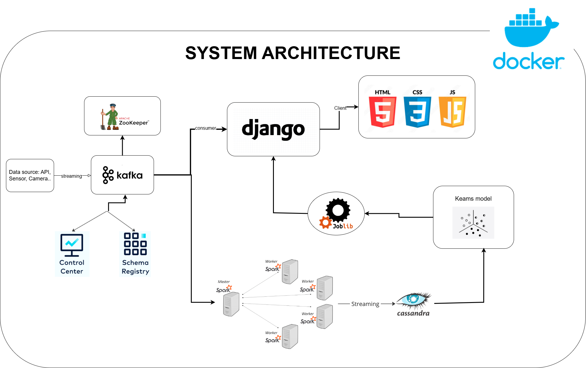

# realtime data streaming from API

# Table of contents
<!-- vscode-markdown-toc -->
* I. [Introduction](#I.Introduction)
	* 1.1 [Overview](#Overview)
	* 1.2 [The goal of this project](#Thegoalofthisproject)
	* 1.3 [Prerequisites](#Prerequisites)
	* 1.4 [Dependencies](#Dependencies)
	* 1.5 [Data sources](#Datasources)
* II. [Architecture](#II.Architecture)
* III. [How It Works](#III.HowItWorks)
* IV. [Usage](#IV.Usage)
	* 4.1 [Prepare infrastructure](#Prepareinfrastructure)
	* 4.2 [Prepare MySQL data](#PrepareMySQLdata)
	* 4.3 [Prepare Medallion Architecture](#PrepareMedallionArchitecture)
	* 4.4 [Prepare dbt-trino](#Preparedbt-trino)
	* 4.5 [Transform MySQL data To DataLake (Minio)](#TransformMySQLdataToDataLakeMinio)
	* 4.6 [Build Data Warehouse (GCP)](#BuildDataWarehouseGCP)
	* 4.7 [Build Data Lakehouse (Dremio)](#BuildDataLakehouseDremio)
	* 4.8 [Connect S3 and GCP in DataLakehouse](#ConnectS3andGCPinDataLakehouse)
		* 4.8.1 [Connect S3](#ConnectS3)
		* 4.8.2 [Connect GCP](#ConnectGCP)
	* 4.9 [Load Data from Data-Lake to Data-Warehouse](#LoadDatafromData-LaketoData-Warehouse)
* V. [Visualization](#V.Visualization)

<!-- vscode-markdown-toc-config
	numbering=true
	autoSave=true
	/vscode-markdown-toc-config -->
<!-- /vscode-markdown-toc -->

##  I. Introduction
    
###  1.1 Overview
This project aims to develop a real-time data streaming system for processing and analyzing data from various sources, including APIs, sensors, and cameras. The system utilizes a robust architecture, leveraging technologies like Docker, Django, Kafka, Spark, and Cassandra to ensure efficient data ingestion, processing, and storage.

###  1.2 The goal of this project
The primary objectives of this project are:
- Establish a scalable and reliable infrastructure for real-time data streaming.
- Implement effective data processing and analysis pipelines.
- Provide valuable insights and visualizations based on the processed data.

###  1.3 Prerequisites
Before proceeding, ensure you have the following prerequisites in place:
- A Docker environment (Docker Desktop or similar).
- Python 3.x installed.
- Basic knowledge of Python programming.
- Familiarity with data streaming concepts.
- Understanding of cloud-based infrastructure (optional).

###  1.4 Dependencies
The project relies on the following dependencies:
- Django
- Kafka
- Spark
- Cassandra
- Docker
- Other libraries and tools as specified in the `requirements.txt` file.

###  1.5 Data sources
The system can ingest data from various sources, including:
- APIs (https://randomuser.me/)
- Sensors (e.g., temperature, humidity, pressure)
- Cameras (e.g., surveillance footage)
- Other real-time data streams

## II. Architecture

 
 

## III. How It Works

1. **Data Ingestion:** Data sources generate real-time data and send it to Kafka.
2. **Data Processing:** Kafka distributes the data to Spark for processing. Spark applies transformations and analysis techniques to extract valuable insights.
3. **Data Storage:** Processed data is stored in Cassandra for future reference and analysis.
4. **Visualization:** Django serves as the frontend, providing a user interface to visualize and interact with the processed data.

## IV. Usage
